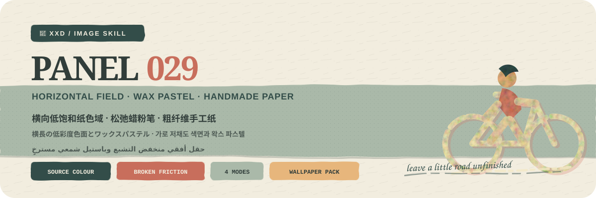
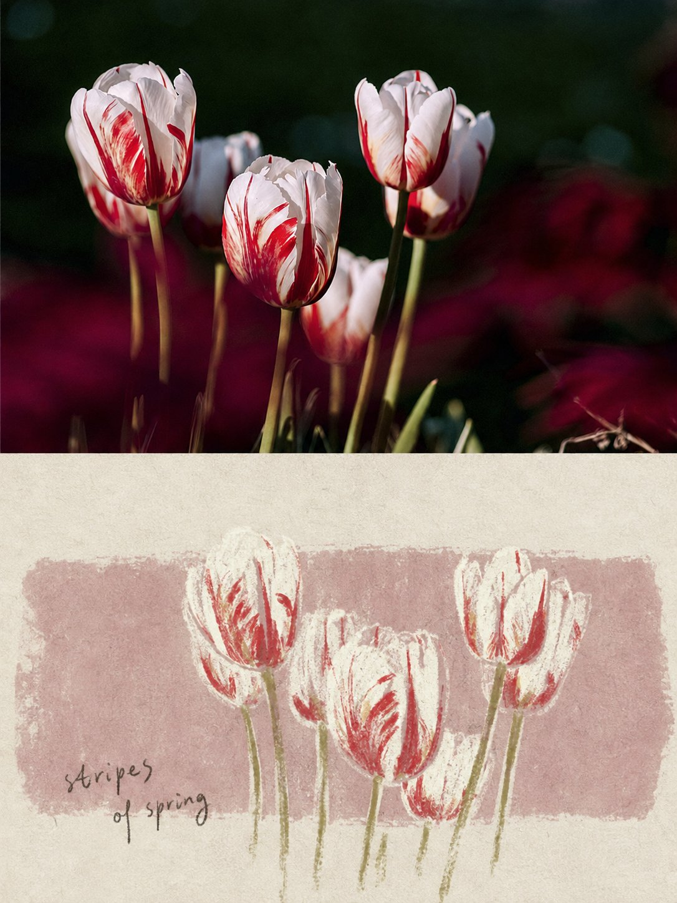
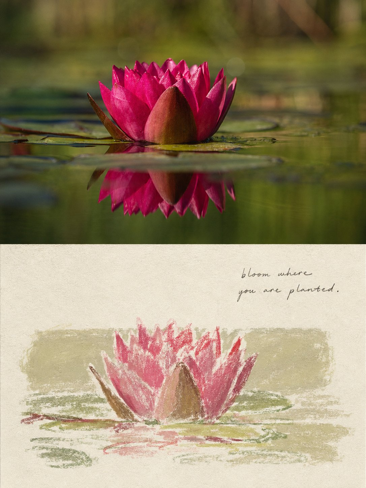

<p align="center">
  
</p>

<div align="center" dir="rtl">

# 🦁 XXD Panel 029

### يعيد رسم الصورة بباستيل شمعي مسترخٍ فوق حقل ورقي أفقي منخفض التشبع

[](./SKILL.md)
[](#أربعة-مخرجات-ومنطق-واحد-للحقل-الأفقي)
[](#الحدود-والثقة)

<a href="README.md">简体中文</a> · <a href="README.en.md">English</a> · <a href="README.ja.md">日本語</a> · <a href="README.ko.md">한국어</a> · <strong>العربية</strong>

</div>

<div dir="rtl">

> حقل أفقي · باستيل شمعي فاتح · ورق يدوي خشن · حبيبات ريسوغراف · كتابة يدوية مسترخية

XXD Panel 029 مهارة لتوليد الصور مخصّصة لـ Codex والوكلاء المتوافقين. تحفظ هوية الصورة ونسبها وتدفق محيطها ووضعيتها واتجاهها وفعلها وعلاقاتها، ثم تعيد رسم الموضوع بكتل وعلامات من باستيل شمعي فاتح ومطفأ فوق ورق يدوي عاجي خشن.

تضع الصورة حقلاً ورقياً أفقياً واحداً منخفض التشبع، مشتقاً من اللون المركّب والإحساس في المصدر الحالي. ويمكن أن ينزاح الموضوع أو يُقتطع أو يعبر حافة الحقل بحسب ثقل المصدر. ويصنع عمق الورقتين الرقيق، والاحتكاك المتقطع الذي يلتقط الألياف، والتقادم المنضبط، وحبيبات الريسوغراف والانزياح الطباعي الدقيق، والكتابة اليدوية الناعمة صورة ورقية تحريرية معاصرة وهادئة.

## لماذا توجد 029؟

ينحدر «رسم الشمع» بسهولة إلى كرتون أطفال، أو صفحة قصاصات رخيصة، أو قالب ثابت وردي مغبر، أو كومة ملصقات تتظاهر بدفء العمل اليدوي.

تعكس 029 هذا الترتيب:

```text
تثبيت الهوية والنسب والإيماءة والعلاقة ← اشتقاق حقل ورقي أفقي واحد منخفض التشبع من المصدر الحالي ← جعل ارتفاع الحقل يستجيب لثقل الموضوع ← التبسيط بباستيل شمعي فاتح ومطفأ ← الإزاحة أو الاقتطاع أو عبور الحافة وفق المصدر ← موازنة الفراغ العلوي والسفلي ← إضافة أثر محدود للألياف والريسوغراف
```

إذا أمكن استبدال المصدر بصورة لا صلة لها من دون تغيير جوهري في إيماءة الموضوع أو نسبة الحقل الأفقي أو عبور الحافة أو اللون المركّب أو إيقاع علامات الشمع أو علاقة الكتابة، فالنتيجة ليست 029.

## العقد البصري لـ 029

- **هوية المصدر:** تحفظ ثلاث علامات محددة على الأقل النسب وتدفق المحيط والوضعية والاتجاه والفعل والوظيفة والعلاقة.
- **حقل أفقي واحد:** يأتي اللون والحرارة والقيمة من الصورة الحالية؛ ويؤلف ارتفاع الحقل وموضعه الرأسي والورق العاجي أعلاه وأسفله نسبة مقصودة واحدة.
- **عبور تفرضه الصورة:** يستجيب حجم الموضوع وإزاحته واقتطاعه وعبوره للحافة العليا أو السفلى لثقل المصدر وحركته، لا لقالب توسيط ثابت.
- **باستيل شمعي فاتح ومطفأ:** تكون العلامات حرة وغير منتظمة ومتقطعة قليلاً وغنية بالاحتكاك والتقاط الألياف، مع بقاء المحيط الضروري للتعرّف مقروءاً.
- **ورقتان:** يبدو الحقل طبقة ورقية ثانية واحدة منخفضة التشبع فوق خامة عاجية خشنة، بعمق حافة منضبط ومن دون فوضى القصاصات.
- **أثر الطباعة:** يضيف التقادم الخفيف وحبيبات الريسوغراف والانزياح الطباعي الدقيق دفئاً ملموساً من دون أن يتحول إلى مرشح متسخ.
- **كتابة يدوية مسترخية:** يتبع سطر قصير حافة الحقل أو إيماءة الموضوع أو الورق المفتوح، مع تشابك أو إزاحة أو عبور خفيف عند الحاجة فقط.

## النماذج · من X

> [Xiaoxiaodong (@xiaoxiaodong01)](https://x.com/xiaoxiaodong01/status/2090452158827422135) · 2026-08-20<br>
> GPT2 x 蜡笔 x 松弛感 x 美学提示词 x VOL.029

<table>
  <tr>
    <td width="50%"><a href="https://x.com/xiaoxiaodong01/status/2090452158827422135"></a></td>
    <td width="50%"><a href="https://x.com/xiaoxiaodong01/status/2090452158827422135"></a></td>
  </tr>
</table>

<p align="center"><a href="https://x.com/xiaoxiaodong01/status/2090452158827422135">عرض المنشور الأصلي والتوجيه كاملاً ←</a></p>

تعرض هذه النماذج الدافع الجمالي للإصدار 029 فقط؛ ولا تصبح موضوعاتها أو تكوينها أو ألوانها أو نصوصها أو نسبة اللوحة السابقة مراجع للتوليد أو إعدادات افتراضية حالية.

## أربعة مخرجات ومنطق واحد للحقل الأفقي

يمكن اختيار نمط واحد أو عدة أنماط معاً. أجب بـ `1` أو `1+3` أو `1،2،4` أو `الكل`؛ تزيل المهارة التكرار وتنفّذ بالترتيب الرقمي من 1 إلى 4. يُسلَّم كل نمط مستقلاً داخل مجلد مهمة منفصل ولا يُجمع في لوحة عامة، ويُنتج خيار «الكل» سبعة ملفات PNG لكل مصدر: ملفاً لكل نمط عادي وأربع خلفيات. يمكن تسمية المقاس بحسب النمط في الرد نفسه، وتظل الأنماط العادية غير المسمّاة متكيفة مع المصدر. ويُشارك النص بين الأنماط المختارة افتراضياً مع إمكان تخصيصه لكل نمط.

| النمط | منطق المقاس | الناتج |
| --- | --- | --- |
| `top-bottom` | متكيف مع المصدر | الصورة كاملة في الأعلى ورسم 029 بالباستيل الشمعي والحقل الأفقي في الأسفل؛ يحتفظ اللوحان بالمقاس وينقسمان 50/50 بدقة |
| `left-right` | متكيف مع المصدر | الصورة كاملة في اليسار ورسم 029 بالباستيل الشمعي والحقل الأفقي في اليمين؛ يحتفظ اللوحان بالمقاس وينقسمان 50/50 بدقة |
| `design-only` | متكيف مع المصدر | التصميم المتحوّل وحده من دون ظهور الأصل؛ يحتفظ بنسبة المصدر وأبعاده |
| `wallpaper-pack` | أربعة مقاسات أجهزة | ملفات PNG منفصلة للهاتف وiPad والحاسوب وساعة الأطفال |

الأولوية هي: البكسلات الدقيقة التي يحددها المستخدم، ثم النسبة أو الوجهة، ثم التكيف مع المصدر في الأنماط العادية. نسبة 3:4 في ملف `029.md` كانت لوحة إبداعية أولى وليست قيمة افتراضية صامتة في المهارة الحالية.

تبقى المنطقة الفوتوغرافية في الأنماط المزدوجة وفية للأصل، مع تلوين تحريري محدود وتوسيع ضروري للبيئة فقط. في التصميم المنفرد والخلفيات تبقى الصورة دليلاً، لكنها لا تظهر في الناتج.

### حزمة الخلفيات: مترابطة أو مستقلة

لا تملك الحزمة مقاسات افتراضية صامتة. يمكن اختيار الإعداد الشائع: الهاتف `1440×3200`، وiPad `2048×2732`، والحاسوب `3840×2160`، والساعة `1024×1024`، أو تقديم مقاسات مخصصة ومسمّاة لكل جهاز.

- **حزمة مترابطة (موصى بها):** يُنشأ تصميم iPad المرجعي ويُعتمد أولاً، ثم تعيد الأجهزة الثلاثة الأخرى التكوين بالرجوع إلى الصورة الأصلية وإلى المرجع نفسه.
- **أربعة أعمال مستقلة:** يرجع كل جهاز إلى الصورة الأصلية وحدها، ويستكشف ارتفاعاً مختلفاً للحقل وحجماً وإزاحة واقتطاعاً وعبوراً للموضوع، ولوناً مركّباً مشتقاً من المصدر، وعلاقة مختلفة للكتابة.

الترابط لا يعني القص. تُولّد الملفات الأربعة وتُركّب وتُراجع منفصلة، من دون سلسلة مراجع متتابعة تسبب الانحراف.

## يدخل النص كإيماءة يدوية أخرى

قبل التوليد، اختر نصاً تلقائياً أو نصاً مخصصاً أو نتيجة بلا نص. عند وجود نص، حدّد اللغة أو المنطقة المستهدفة.

يستخلص النص التلقائي سطراً قصيراً من عاطفة أو فعل أو حالة أو علاقة أو استعارة ظاهرة في الصورة أو تدعمها. يجب أن يبدو غير قابل للفصل عن الموضوع، لا شعراً غامضاً يتظاهر بالرقي. ويستخدم مقابلاً يدوياً طبيعياً للخط المستهدف، ناعماً ومسترخياً ومخربشاً قليلاً مع بقائه مقروءاً، يتبع الحقل أو الإيماءة أو الورق المفتوح.

العنوان الواحد هو الإعداد الافتراضي. لا تُضاف من صفر إلى ملاحظتين قصيرتين إلا حين تحملان معلومة حقيقية، ولا تُختلق أرقام أو سنوات أو إحداثيات أو ملصقات أرشيفية لمجرد إظهار الرقي.

يحافظ على النص النهائي الذي يقدمه المستخدم حرفياً. أما الاتجاه الإبداعي أو المسودة القابلة للتحرير فلا تُصقل إلا مع الحفاظ على الجمهور والهدف والكلمات الإلزامية والنبرة والدلالة.

تتبع اللغة الجمهور المقصود لا لغة الأمر:

```text
السوق أو الجمهور المستهدف > لغة الناتج المحددة > لغة التوجيه؛ وإذا غابت كلها يُسأل المستخدم قبل التوليد
```

تستخدم النسخة اليابانية يابانية طبيعية، والنسخة الكورية كورية طبيعية بمسافات صحيحة، والنسخة البريطانية إنجليزية بريطانية، وتستخدم العربية افتراضياً العربية الفصحى المعاصرة مع تركيب حقيقي من اليمين إلى اليسار. لا تستنتج المهارة الجنسية من الوجه أو الملابس أو المشهد أو اللافتات، ولا تستخدم نصاً أجنبياً زائفاً للزينة.

## الشيفرة تضبط الهندسة وتوليد الصور يصنع العمل

ينشئ نموذج الصور الحقل الأفقي المشتق من المصدر، ونسب الموضوع وعبوره للحافة، واحتكاك الباستيل الشمعي الفاتح، وألياف الورق العاجي الخشن، وعمق الورقتين، وحبيبات الريسوغراف، والكتابة اليدوية المسترخية. ولا يتولى `scripts/compose_panel.py` سوى تخطيط اللوحة والتركيب النقطي الدقيق بنسبة 50/50 وتثبيت المقاس والمراجعة؛ ولا يرسم العمل برمجياً.

```bash
python3 scripts/compose_panel.py --plan --layout top-bottom --source photo.png
python3 scripts/compose_panel.py --plan --layout left-right --size 2560x1440
python3 scripts/compose_panel.py --audit result.png --layout design-only --size 2048x2048
```

يتطلب التخطيط العلوي/السفلي الدقيق ارتفاعاً كلياً زوجياً، ويتطلب التخطيط الأيسر/الأيمن عرضاً كلياً زوجياً. لا تغيّر المهارة البكسلات المطلوبة بصمت.

## البدء

```bash
git clone https://github.com/nevertoday/xxd-panel-029.git
mkdir -p ~/.codex/skills
ln -s "$(pwd)/xxd-panel-029" ~/.codex/skills/xxd-panel-029
```

يمكن لمستخدمي Claude Code ربط المجلد نفسه بـ `~/.claude/skills/xxd-panel-029`. أعد تشغيل جلسة الوكيل بعد التثبيت.

```text
$xxd-panel-029
حوّل هذه الصورة إلى تكوين يسار/يمين، واستخرج العبارة من معناها، واكتبها بالعربية الفصحى المعاصرة.
```

يمكن أيضاً استدعاء المهارة بصورة وحدها. ستسأل أولاً عن نمط واحد أو عدة أنماط وعن إعداد النص في قائمة مرقمة متعددة الأسطر؛ ويسأل نمط الخلفيات أيضاً عن الترابط والمقاسات.

المواصفات الكاملة:

- [مسار عمل المهارة](SKILL.md)
- [التوجيه الصيني الكامل](references/xxd-panel-029-prompt.zh-CN.md)
- [التوجيه الإنجليزي الكامل](references/xxd-panel-029-prompt.en.md)
- [موجز الأسلوب الأصلي](references/029-source.md)

## الحدود والثقة

- تبقى كل صورة داخل مهمتها ولا تستعير موضوعاً أو لوناً أو نصاً أو تكويناً من مدخل آخر أو نتيجة قديمة أو نموذج.
- ينشئ كل استدعاء مجلد مهمة جديداً، حتى عند تكرار المصدر والمعلمات.
- النتائج ملفات PNG نقطية، وليست SVG أو HTML أو Canvas أو بديلاً مرسوماً برمجياً.
- لا يعرض جسر الصور المضبوط سوى حالة منزوعة التفاصيل، ولا يكشف المزوّد أو نقطة الاتصال أو الرؤوس أو بيانات الاعتماد أو التوجيه أو نص الاستجابة.
- يعيد كل نمط عادي مختار ملفاً واحداً، ويضيف اختيار `wallpaper-pack` أربع خلفيات مستقلة. يعيد خيار «الكل» سبعة ملفات PNG لكل مصدر داخل أربعة مجلدات أنماط متجاورة، ولا ينشئ لوحة تجميع أو عرضاً عاماً.

يحتاج التركيب المحلي إلى Python 3 وPillow. يستخدم الجسر الآمن `tomllib` في Python 3.11 أو أحدث. ويحتاج توليد الصور إلى قدرة نقطية مدمجة في الوكيل المضيف أو مسار نقطي متوافق ومضبوط مسبقاً.

## المستودع

```text
xxd-panel-029/
├── SKILL.md
├── README.md / README.en.md / README.ja.md / README.ko.md / README.ar.md
├── agents/openai.yaml
├── assets/banner.svg + examples/ (محجوز لنماذج محلية مستقبلية)
├── scripts/compose_panel.py + configured_imagegen.py
└── references/xxd-panel-029-prompt.zh-CN.md + xxd-panel-029-prompt.en.md + 029-source.md
```

## عن XXD

XXD هو الاختصار التجاري لاسم Xiaoxiaodong. أنشأ المشروع ويديره [@xiaoxiaodong01](https://x.com/xiaoxiaodong01).

## الدعم والعضوية

### استشارة متعمقة · 299 يواناً صينياً/ساعة

تبلغ تكلفة الاستشارة الفردية المتعمقة في استخدام Skills مقدار 299 يواناً صينياً في الساعة. للحجز، تواصل عبر رمز WeChat أدناه.

### مجموعة مستخدمي Xiaoxiaodong Skills · 99 يواناً صينياً

تتيح دفعة واحدة قدرها 99 يواناً الانضمام إلى مجموعة تبادل سير العمل ومناقشة الأعمال والدعم بين المستخدمين. ولا تشمل الاستشارة الفردية المحسوبة بالساعة.

### Knowledge Planet＋مكتبة توجيهات الأعضاء · 699 يواناً صينياً/سنة

[Knowledge Planet](https://wx.zsxq.com/group/15554814142882) و[مكتبة توجيهات XXD](https://vip.xiaoxiaodong.ai/) عضوية واحدة: **دفعة سنوية واحدة تفتح الخدمتين من دون شراء ثانٍ.**

1. اشترك عبر Knowledge Planet ثم تواصل عبر WeChat للحصول على رمز استبدال المكتبة.
2. اشترك عبر مكتبة التوجيهات ثم تواصل عبر WeChat للحصول على دعوة إلى Knowledge Planet.

<p align="center">
  <a href="https://xiaoxiaodong.pages.dev/assets/wechat-qr.png"></a>
</p>

<div align="center" dir="rtl">

**دع حقلاً أفقياً واحداً يحمل الموضوع، والجملة التي لا تنتهي تماماً.**

</div>

</div>

---

<div align="center" dir="rtl">
  <h2>☕ ادعم هذا المشروع مفتوح المصدر</h2>
  <p>إذا وفّر عليك المشروع وقتاً، فإن نجمة أو مشاركة أو فنجان قهوة يساعد في استمراره.</p>
  <table><tr><td align="center" width="240">
    <a href="https://github.com/nevertoday/zhongguo-traditional-colors/blob/main/docs/images/buy-me-a-coffee-qr.png?raw=true"></a><br>
    <strong>Buy me a coffee</strong><br><sub>امسح رمز QR أو افتحه لدعم Xiaoxiaodong</sub>
  </td></tr></table>
  <p><sub>الدعم اختياري تماماً ولا يغيّر حق الوصول إلى هذا المشروع مفتوح المصدر.</sub></p>
</div>
